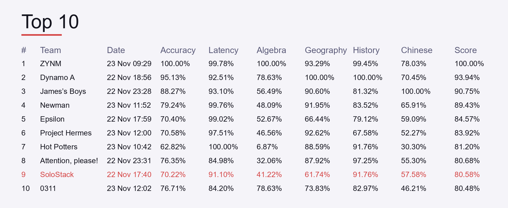

## Tech Arena 2025 - Efficient LLM Inference Pipeline (with Fine-Tuning)

### Challenge Overview
This repository contains my submission for the Huawei Ireland Research Center Tech Arena 2025 (Phase 2) challenge, *Spend Less and Do More – An LLM Efficiency Challenge*. The brief focuses on building an efficient single-round question-answering pipeline that maximizes accuracy while minimizing end-to-end latency. The evaluator combines multiple optimizations such as RAG, efficient serving, and compact model design, so every engineering choice must deliver measurable latency savings without sacrificing answer quality.

### Objective & Metrics
- **Goal**: Deliver an optimized LLM inference pipeline for single-turn QA (no conversation memory).
- **Optimization levers**: context/orchestration (RAG, tools, prompt engineering), deployment/serving (specialized accelerators, async serving, prefix/response caching), and model design (quantization, pruning, efficient attention, token fusion, model merging, low-rank factorization).
- **Scoring**: Weighted sum of accuracy (60%) and end-to-end latency (40%). Leaderboard values are normalized where the best run per metric defines 100%. Entries must achieve ≥10% accuracy to appear on the board.
- **Judge setup**: Accuracy is evaluated by an LLM-as-a-judge with up to 1,047,576 input tokens and 32,768 output tokens per request. Latency excludes pure I/O and one-time setup.

### SoloStack Leaderboard Snapshot
- SoloStack was my one-person team (Sajjad Hesamipour Khelejan) and finished 10th overall with an 80.58% score—just 0.10 points shy of the top-eight cutoff.
- Algebra lagged compared to other subjects, but latency remained competitive, so even small accuracy bumps would have moved the team several spots up.
- RAG components made the model very inaccurate, but I kept them in the repo for showcase purposes and will revisit the retrieval issues later.


Tech Arena 2025 Top 10 leaderboard (captured minutes before the competition ended)

### Implementation Overview
- **Offline-first pipeline** – `pipeline.py` forces Hugging Face offline mode, blocks outbound calls, and fails fast if the requested model/tokenizer/adapter files are not cached under `/app/models` (or `HF_CACHE_DIR`).
- **Subject-aware adapters** – Questions are grouped by `subject` and routed to LoRA adapters housed in `main/inferencePipeline/adapters/qwen3-1.7b-lora-*`. If a subject-specific adapter is missing, the loader falls back to the general adapter.
- **Quantized batching** – Default model is `Qwen/Qwen3-1.7B`. When `USE_4BIT=1` and a CUDA GPU is present, the pipeline loads NF4 weights via bitsandbytes; otherwise it picks the best BF16/FP16 dtype. Left padding and prompt slicing keep VRAM stable even with `BATCH_SIZE=48`.
- **Answer sanitation** – `_clean_answer` strips `<think>` tags, duplicated lines, and prompt echoes so the evaluator only sees concise final answers.
- **RAG kept for demos** – `rag.py` + `knowledge_bases/` provide deterministic retrieval, but `RAG_ENABLED_SUBJECTS = {}` because the extra context currently reduces accuracy. The code stays in place for future showcase experiments.

### Repository Layout
```
.
├─ assets/                      # Figures (e.g., top10 leaderboard)
├─ data/                        # Training corpora / local samples
├─ main/
│  ├─ inferencePipeline/
│  │  ├─ adapters/              # LoRA checkpoints per subject
│  │  ├─ knowledge_bases/       # Preprocessed KBs for optional RAG
│  │  ├─ pipeline.py            # Offline inference entry point
│  │  ├─ prompt.py              # Subject-aware templates
│  │  ├─ rag.py & preprocess_kb.py
│  │  └─ utils.py               # batching helpers
│  ├─ requirements.txt
│  └─ run.py                    # Local driver (not used by evaluator)
├─ training/                    # QLoRA fine-tuning utilities
└─ adapters/                    # Optional extra adapters (same naming scheme)
```

### Setup & Installation
1. `pip install -r main/requirements.txt` inside your virtual environment.
2. Pre-download `Qwen/Qwen3-1.7B` (or your override) plus tokenizer files into `/app/models` or export `HF_CACHE_DIR` to another cache.
3. Copy LoRA adapters under `main/inferencePipeline/adapters/qwen3-1.7b-lora-*` or point the `PEFT_ADAPTER_*` env vars at your own folders.
4. (Optional) Generate cleaner KBs via `python main/inferencePipeline/preprocess_kb.py --subject algebra --input path/to/raw_kb.json --out main/inferencePipeline/knowledge_bases`.
5. Run `python main/run.py` to produce `answers.jsonl` and validate formatting before uploading the submission zip.

### Environment Knobs (defaults from `config.py`)
- `MODEL_NAME=Qwen/Qwen3-1.7B`
- `HF_CACHE_DIR=/app/models`
- `USE_4BIT=1`, `DEVICE_MAP=cuda:0|cpu|auto`
- `BATCH_SIZE=48`, `MAX_NEW_TOKENS=128`, `MIN_NEW_TOKENS=20`, `MAX_INPUT_TOKENS=1024`, `MAX_TOKENS_MULTIPLIER=1.0`
- Sampling controls: `TEMPERATURE=0.2`, `TOP_P=0.9`, `TOP_P_CAP=0.9`, `TOP_K=20`, `REPETITION_PENALTY=1.0`
- Adapter overrides: `PEFT_ADAPTER_PATH`, `PEFT_ADAPTER_ALGEBRA`, `..._GEOGRAPHY`, `..._HISTORY`, `..._CHINESE`, `..._GENERAL`, plus `ADAPTERS_BASE_DIR`
- RAG inputs: `RAG_KNOWLEDGE_BASE_DIR`, `RAG_TOP_K`, `RAG_ENABLED_SUBJECTS` (set to a JSON dict like `{"geography": true}` if you want to re-enable RAG)

### Running Inference
```python
from inferencePipeline import loadPipeline

pipeline = loadPipeline()
answers = pipeline([
    {"questionID": "demo-001", "subject": "history", "question": "Compare the Roman and Han collapses."}
])
```
- The evaluator calls `loadPipeline()` and passes a list of dicts containing `questionID`, `subject`, and `question`. Responses must stay in the same order; the pipeline handles batching, adapter selection, and cleaning.
- `python main/run.py` looks for `data/sample_questions.jsonl` (JSON Lines). If it is missing, the script falls back to a built-in mini batch so you can still sanity-check the formatting. Answers are echoed to stdout and saved to `answers.jsonl`.
- Always run `python -m main.run` (or `python main/run.py`) after exporting your env overrides: e.g., PowerShell ` $env:MODEL_NAME="Qwen/Qwen3-0.6B"`; Bash `MODEL_NAME=... python main/run.py`.

### Knowledge Bases & RAG Status
- `rag.py` implements a lightweight token-overlap retriever with optional tag/pattern boosts and caches per subject. Because it hurt leaderboard accuracy, `RAG_ENABLED_SUBJECTS` defaults to an empty dict: RAG is effectively disabled but the hooks remain for future demos.
- To experiment regardless, preprocess your KB and set `RAG_ENABLED_SUBJECTS` to a JSON dict plus `RAG_KNOWLEDGE_BASE_DIR` to the folder containing `{subject}_knowledge_preprocessed.json`.
- Retrieval failures degrade gracefully (empty strings), so enabling RAG will not crash inference, but you are responsible for validating accuracy impacts.

### Fine-Tuning (LoRA)
- `training/finetune.py` loads JSON/JSONL corpora (`{"question": "...", "answer": "..."}`) and trains LoRA adapters entirely offline. Output directories are auto-derived from the base model name unless you pass `--out`.
- Multi-subject run (writes algebra/geography/history/general adapters):
  ```bash
  python training/finetune.py \
    --model Qwen/Qwen3-1.7B \
    --data_algebra data/train_algebra.json \
    --data_geography data/train_geography.json \
    --data_history data/train_history.json \
    --data_general data/train.json \
    --out adapters
  ```
- Single-subject refresh:
  ```bash
  python training/finetune.py \
    --model Qwen/Qwen3-1.7B \
    --data_algebra data/train_algebra.json
  ```
- After training, point the corresponding `PEFT_ADAPTER_*` env vars to the produced folders (or copy them under `main/inferencePipeline/adapters/`) before rerunning inference.


